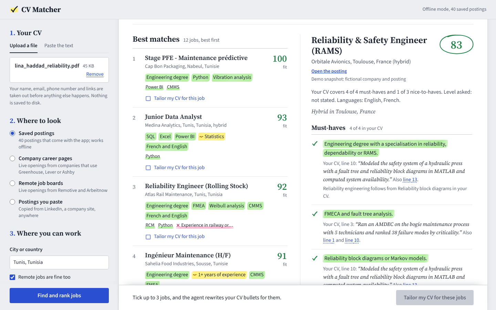
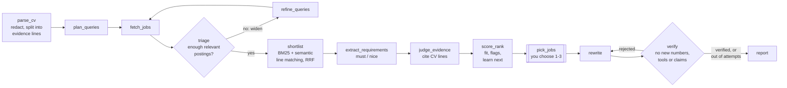
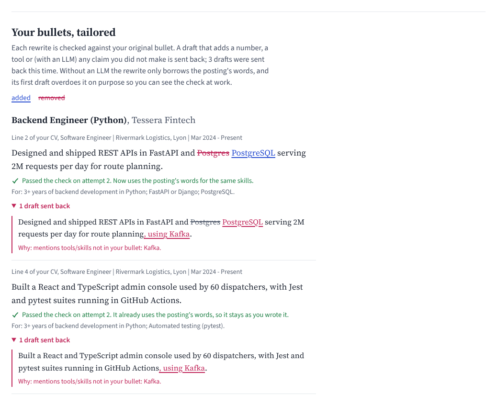

# CV Matcher: the full guide

The short version is in the [README](../README.md).

CV Matcher reads your CV, finds real openings, and ranks them requirement by requirement. Every
verdict cites the exact line of your CV that proves it. It also lists the skills that would unlock
the most jobs, and rewrites your bullets for the jobs you pick, with a verifier that rejects any
draft that invents a tool, a number or a claim.

- **Backend:** Python, FastAPI, LangGraph. Runs fully offline with rule-based matching, or with any
  OpenAI-compatible LLM (Gemini, Groq, OpenAI, Ollama…).
- **Frontend:** React and TypeScript (Vite). The agent's progress streams live over Server-Sent Events.



---

## Contents

1. [Run it](#1-run-it)
2. [Use your own CV and real jobs](#2-use-your-own-cv-and-real-jobs)
3. [Add an LLM (optional)](#3-add-an-llm-optional)
4. [How it works](#4-how-it-works)
5. [Evaluation](#5-evaluation)
6. [Tests](#6-tests)
7. [Project structure](#7-project-structure)
8. [Configuration](#8-configuration)
9. [Troubleshooting](#9-troubleshooting)
10. [Demo video and resume lines](#10-demo-video-and-resume-lines)
11. [Data sources, terms and privacy](#11-data-sources-terms-and-privacy)

---

## 1. Run it

### What you need

- **Python 3.10, 3.11, 3.12 or 3.13** from [python.org](https://www.python.org/downloads/). On Windows,
  tick *"Add python.exe to PATH"* in the installer.
- **Node.js 20.19+ or 22.12+** (the LTS version) from [nodejs.org](https://nodejs.org/). You only need
  it to change the React code: the zip already contains the built web app.
- No API key and no internet connection are needed for the demo. The first run with the semantic
  model downloads about 220 MB once (see below).

### The easy way: one double-click

- **Windows:** double-click `start.bat` in the `cv-matcher` folder.
- **macOS / Linux:** run `./start.sh`.

Your browser opens **http://localhost:8000**. Keep the launcher's window open while you use the app,
and close it to stop. The first time, it creates the Python environment in `backend/.venv` and
installs the packages, which takes a few minutes. After that it starts in a few seconds.

Then upload your CV (PDF or plain text, or paste its text), pick *Jobs you saved from LinkedIn* (see
[Jobs from LinkedIn](#jobs-from-linkedin)) or *Example postings*, and
click **Find and rank jobs**. When the ranking appears, pick one to three jobs and click
**Tailor my CV**.

**Reading the results.** Every requirement is marked like a printed posting you went over with a
highlighter: green means a line of your CV shows it, yellow means only partly, pink means nothing in
your CV shows it. Must-haves get a full highlight, nice-to-haves an underline, and the margin gets a
tick, a wavy line or a cross. Open a job to see each requirement next to the line of your CV behind
it.

### Development mode (two terminals, live reload)

Use this when you change the code. You run two programs side by side: the **API** on port 8000 and
the **web app** on port 5173, which reloads as soon as you save a file.

**Terminal 1: the API.**

Windows (PowerShell):

```powershell
cd cv-matcher\backend
py -m venv .venv
.venv\Scripts\Activate.ps1
pip install -r requirements.txt
copy .env.example .env
uvicorn app.main:app --reload --port 8000
```

macOS / Linux:

```bash
cd cv-matcher/backend
python3 -m venv .venv
source .venv/bin/activate
pip install -r requirements.txt
cp .env.example .env
uvicorn app.main:app --reload --port 8000
```

When it works, the terminal shows `Uvicorn running on http://127.0.0.1:8000`. Keep that terminal open.

**Terminal 2: the web app.**

```bash
cd cv-matcher/frontend
npm install
npm run dev
```

Open **http://localhost:5173**.

> **Shortcut:** on Windows you can double-click `backend/run.bat`, then `frontend/run.bat`. On
> macOS/Linux, run `./backend/run.sh` and `./frontend/run.sh`. On first use, each script creates its
> environment and installs the packages.

> **If PowerShell blocks `Activate.ps1`,** run
> `Set-ExecutionPolicy -Scope CurrentUser RemoteSigned` once. You can also use the Command Prompt
> instead, with `.venv\Scripts\activate.bat`.

### How the one-click mode works

When `frontend/dist` exists, FastAPI serves the built React app itself, so one program is enough.
That is what `start.bat` and `start.sh` run. After changing the React code, rebuild it with
`npm run build` in `frontend`, or delete `frontend/dist` and the launcher rebuilds it.

### First-run notes

- **Semantic model.** The first analysis downloads the multilingual embedding model
  `paraphrase-multilingual-MiniLM-L12-v2` (~220 MB, via fastembed/ONNX, no PyTorch). Later runs are
  instant. You can pre-download it with `python scripts/warm_up.py`. If the download is blocked or slow,
  set `EMBEDDINGS=tfidf` in `backend/.env`; everything still works, with a TF-IDF fallback.
- **Check the install:** inside `backend` (with the venv active), run `pytest`. You should see
  `31 passed` in about 3 seconds.

---

## 2. Use your own CV and real jobs

**Your CV.** Upload a PDF or a `.txt` file, or paste the text. Your email, phone, links, street
address and name are removed **before** any processing. Nothing is written to disk except the
optional cache of LLM answers in `backend/.cache`. A scanned PDF has no text layer; if yours is one,
paste the text instead.

**Job sources** (step 2 in the app):

| Source | What it uses | Notes |
|---|---|---|
| Jobs you saved from LinkedIn | Jobs you sent from LinkedIn with the **Send to CV Matcher** button | See [Jobs from LinkedIn](#jobs-from-linkedin) below. Every saved job is analysed (up to 30). |
| Example postings | `backend/data/demo_jobs.json`: 40 **fictional** postings | Offline. Mixes reliability/maintenance, data and software roles, some in French and one in German. |
| Company career boards | Public job-board APIs of **Greenhouse**, **Lever** and **Ashby** | Enter board names or careers URLs, e.g. `stripe, notion, jobs.lever.co/palantir`. The board name is the part after `boards.greenhouse.io/`, `jobs.lever.co/` or `jobs.ashbyhq.com/`. |
| Remote job boards | **Remotive** (remote jobs) and **Arbeitnow** (mostly Europe) | Searched with the titles from your CV. Remotive allows 2 requests a minute, so answers are cached for 6 hours. |
| Postings you paste | Any posting you copy (LinkedIn, local job boards, a company site…) | Separate several postings with a line containing only `---`. Optional first lines: `Title:`, `Company:`, `Location:`, `URL:`. A whole LinkedIn job page copied with Ctrl+A is cleaned up automatically. |

**Many companies (especially outside the US) use other systems, such as Workday or their own
site.** For those, use *Postings you paste*.

**Make a reproducible snapshot of real jobs** (handy for demos and for evaluating on real data):

```bash
cd backend
python scripts/save_snapshot.py --companies "stripe, notion" --out data/my_jobs.json
# then in backend/.env:  SNAPSHOT_PATH=data/my_jobs.json   and pick "Example postings" in the app
```

### Jobs from LinkedIn

You browse LinkedIn as usual; one click sends the job you are reading to CV Matcher.

1. In the app, choose *Jobs you saved from LinkedIn* and drag the **Send to CV Matcher** button to
   your browser's bookmarks bar (no bookmarks bar? press Ctrl+Shift+B).
2. Open a job or internship on LinkedIn (signed in or not) and click the bookmark. A small window
   says *Saved* and closes itself. The app's list updates on its own.
3. Back in the app, press **Find and rank jobs**: every saved job is ranked against your CV.

How it works: the bookmark runs in your own browser, on the page you are looking at, and reads what
that page already shows (title, company, location, description). It opens CV Matcher with the
posting in the address after `#`, which the browser keeps local, and the app saves it to
`backend/data/saved_postings.json`. The app never connects to LinkedIn and never loads LinkedIn
pages on its own: it only receives what you send it, one job at a time.

If LinkedIn changes its page layout and a job comes out without a description, select the
description with your mouse and click the bookmark again: your selection is used. If the browser
blocks the small window, allow pop-ups for linkedin.com. You can also copy a whole LinkedIn job page
(Ctrl+A, Ctrl+C) into *Postings you paste*.

---

## 3. Add an LLM (optional)

Without an LLM, the app uses rules plus a 190-skill English/French vocabulary. With an LLM, these steps
use the model instead:

- the profile, search queries and query refinement;
- reading requirements from free-form postings;
- judging the evidence;
- rewriting bullets, plus an extra claim check in the verifier.

Edit `backend/.env`, uncomment **one** block, add your key and restart the API:

| Provider | Cost | `LLM_BASE_URL` | `LLM_MODEL` example |
|---|---|---|---|
| Google Gemini | free tier | `https://generativelanguage.googleapis.com/v1beta/openai/` | `gemini-3.8-flash` |
| Groq | free tier | `https://api.groq.com/openai/v1` | `openai/gpt-oss-20b` |
| Ollama (runs on your PC) | free | `http://localhost:11434/v1` | `qwen3:8b` |
| OpenAI | paid | `https://api.openai.com/v1` | `gpt-5-nano` |

- **Model names change often.** If you get "model not found", check the provider's model list.
- **Free tiers limit requests per minute.** A run makes about 40 to 50 LLM calls. Set `LLM_MAX_RPM`
  (for example 10) to stay under your provider's limit; the run then takes a few minutes.
- `LLM_MODEL_STRONG` (optional) is used only for rewriting bullets.
- Every LLM answer is cached in `backend/.cache`, so re-running the same CV is free. Delete that
  folder to clear it.
- The app's **Engine** box shows which mode is active. To switch the LLM off for a single run, use
  the checkbox above the **Find and rank jobs** button.

---

## 4. How it works



The agent is a **LangGraph** state machine (`backend/app/graph.py`) with two self-correction loops
and one human checkpoint:

1. **Read the CV.** It redacts contact details, then splits the CV into numbered *evidence lines*
   (E1, E2…). They are always taken **verbatim** from your CV, never paraphrased by a model, so every
   quote you see is something you actually wrote.
2. **Search (loop 1).** It starts narrow (titles from your strongest domain) and keeps the postings
   whose title matches a query or that share enough skills with your CV. If too few are relevant, it
   widens the search with related titles and French/English variants (the LLM reads the rejected
   titles when one is configured), up to 2 times.
3. **Shortlist.** It keeps the best 12 using BM25 plus *semantic line matching*: every line of the
   posting is compared with every line of your CV (multilingual embeddings), and the two rankings are
   merged with reciprocal rank fusion. This is the only place similarity scores are used; they
   decide what gets analysed, not the final ranking.
4. **Requirements and evidence.** Each posting becomes a list of must-haves and nice-to-haves. Each
   requirement is judged *met*, *partially met* or *missing*, citing evidence lines.
   **No evidence, no credit:** an LLM verdict that cites no real line of your CV is downgraded to
   missing, and the UI shows how many were.
5. **Score.** Plain arithmetic, so the same verdicts always give the same score:
   `fit = 0.75 × must-have coverage + 0.25 × nice-to-have coverage` (partial counts 0.5).
   Location, language and seniority mismatches are shown as separate flags and do not change the
   score. **Learn next** shows, for each missing skill, how many of your top jobs ask for it and how
   many jobs it would fully unlock (jobs where it is the only missing must-have).
6. **You pick** 1 to 3 jobs. This is a LangGraph `interrupt`, so the run waits for you.
7. **Tailor and verify (loop 2).** For each picked job, the 2 or 3 bullets that best support it are
   rewritten using the posting's terms (`sklearn` → `scikit-learn`, `AMDEC` → `AMDEC (FMEA)`). The
   verifier rejects any draft that adds a number or a tool/skill not in the original bullet, or
   grows too long. With an LLM, it also runs a claim check. A rejected draft goes back with the
   reasons. After 3 failed attempts, your original bullet is kept.



### Design decisions

- **Requirement-level scoring, not one cosine between CV and posting.** Whole-document similarities
  bunch together and cannot say *why*. Here, each point of the score traces back to a requirement
  and a CV line.
- **Synonyms and "members" are different.** In the vocabulary, `AMDEC` is a synonym of FMEA, while
  `Plotly` is a *member* of data visualization: it counts as evidence, but it is never swapped into a
  bullet. Weak wording such as "vibration data" earns *partial*, never *met*.
- **The verifier is deterministic first.** Numbers and tool names are checked with code, so the
  check holds even when the LLM misbehaves. The LLM claim check comes on top.
- **No FAISS.** One CV against a few hundred postings takes milliseconds with NumPy dot products. A
  vector index would only add moving parts.
- **No LinkedIn scraping.** LinkedIn's terms forbid it, and it has sued scraping companies. The
  public applicant-tracking-system APIs used here are published so that job posts can be shown
  elsewhere.
- **Offline mode is a first-class path.** It keeps the app free to run, makes the tests
  deterministic, and serves as the baseline in the evaluation.

---

## 5. Evaluation

```bash
cd backend
python -m eval.run_eval              # ranking quality, offline rules
python -m eval.run_eval --llm        # same, with your configured LLM
python -m eval.fabrication_check --llm
```

**Ranking (NDCG@5).** For each labelled CV, the same 10 labelled postings are ranked four ways: a
TF-IDF cosine baseline, an embedding cosine, the hybrid shortlist, and the full pipeline. Results on
the bundled data, offline mode, TF-IDF similarity:

| Method | NDCG@5 |
|---|---|
| TF-IDF cosine (whole documents) | 0.889 |
| Hybrid retrieval (BM25 + semantic line matching, RRF) | 0.938 |
| Full pipeline (requirement-level fit) | 0.990 |

**Read these numbers as a smoke test, not a result.** The postings, the three CVs, the labels and the
offline rules were all written by the same person, on the same small set. Before putting a number on
a resume:

1. save a snapshot of real postings with `scripts/save_snapshot.py`;
2. label 30 or more CV–job pairs yourself in a copy of `eval/labels.json` (0 = poor, 1 = stretch,
   2 = would apply);
3. run `python -m eval.run_eval --llm --labels my_labels.json --jobs data/my_jobs.json`.

The embedding row appears once the embedding model is downloaded.

**Fabrication check.** It compares the rewriter's first draft (verifier off) with the final bullet
(verifier on). It reports the share of bullets that add numbers or tools, and writes
`eval/fabrication_review.csv` so you can hand-label subtler problems. Offline, the first draft is a
deliberate keyword-stuffing baseline, so only the `--llm` numbers mean something.

---

## 6. Tests

```bash
cd backend && pytest
```

The 37 tests cover:

- the skill vocabulary (EN/FR aliases, false positives such as "R&D" or "power transformers");
- redaction and segmentation of the sample CVs;
- requirement parsing ("1 à 3 ans", any-of requirements);
- evidence judging and scoring;
- the verifier;
- the job-board parsers (against fixtures shaped like each API's documented response);
- reading copied LinkedIn job pages (English and French, signed in or out) and the saved-jobs API;
- the full graph with the interrupt and resume;
- the API end to end;
- the whole LLM path, with a fake provider that returns broken JSON, invented evidence IDs and an
  invented metric, to prove the repair, the evidence guard and the verifier work.

Frontend type check: `cd frontend && npm run typecheck`.

---

## 7. Project structure

```
cv-matcher/
├── README.md
├── start.bat / start.sh          one-click start (serves everything on http://localhost:8000)
├── docs/                         screenshots
├── backend/
│   ├── requirements.txt
│   ├── .env.example              copy to .env (LLM keys and settings)
│   ├── run.bat / run.sh          one-click start
│   ├── app/
│   │   ├── main.py               FastAPI: runs, live events (SSE), selection, report
│   │   ├── runs.py               runs the graph in a background thread, records events
│   │   ├── graph.py              the LangGraph agent (nodes, loops, interrupt)
│   │   ├── cv_parser.py          PDF text, redaction, evidence lines, offline profile
│   │   ├── skills.py             190-skill EN/FR vocabulary, synonyms vs members, languages
│   │   ├── roles.py              role families and titles (EN/FR) for search and triage
│   │   ├── postings.py           splits a posting into requirements / duties / boilerplate
│   │   ├── requirements.py       must-have and nice-to-have extraction (rules or LLM)
│   │   ├── judge.py              evidence judging (rules or LLM) with the evidence guard
│   │   ├── retrieval.py          BM25, embeddings (fastembed) or TF-IDF, MaxSim, RRF, triage
│   │   ├── scoring.py            fit score, flags, learn next
│   │   ├── tailor.py             bullet choice, rewriting, verifier
│   │   ├── report.py             Markdown report
│   │   ├── saved.py              jobs you saved from LinkedIn (data/saved_postings.json)
│   │   ├── llm.py                OpenAI-compatible client, JSON repair, rate limit, cache
│   │   ├── cache.py, config.py, schemas.py, text.py
│   │   └── sources/              Greenhouse, Lever, Ashby, Remotive, Arbeitnow, snapshot, paste,
│   │                             and linkedin.py (reads a copied LinkedIn job page)
│   ├── data/
│   │   ├── demo_jobs.json        40 fictional postings
│   │   ├── saved_postings.json   created when you save your first LinkedIn job
│   │   └── sample_cvs/           3 fictional CVs (.txt and .pdf), used by the tests
│   ├── eval/                     labels, ranking eval, fabrication check
│   ├── scripts/                  save_snapshot.py, warm_up.py
│   └── tests/                    pytest suite
└── frontend/
    ├── package.json, vite.config.ts (proxies /api to :8000), index.html
    ├── run.bat / run.sh
    └── src/
        ├── App.tsx               state, live events, layout
        ├── api.ts, types.ts, diff.ts, useNarrow.ts, styles.css
        ├── bookmarklet.ts        the Send to CV Matcher bookmark
        └── components/           SetupForm, PipelineRail, AgentLog, ProfileSummary,
                                  JobList, InspectionSheet, LearnNext, TailorPanel, marks,
                                  LinkedInSaved (saved list), SaveFromLinkedIn (save window)
```

---

## 8. Configuration

All settings live in `backend/.env` (see `.env.example` for comments).

| Variable | Default | Meaning |
|---|---|---|
| `LLM_BASE_URL`, `LLM_API_KEY`, `LLM_MODEL` | empty | Any OpenAI-compatible endpoint. Empty means offline mode. |
| `LLM_MODEL_STRONG` | = `LLM_MODEL` | Model used for rewriting only. |
| `LLM_MAX_RPM` / `LLM_CONCURRENCY` | 0 / 4 | Requests-per-minute cap (0 = none) and parallel calls. |
| `FORCE_OFFLINE` | false | Ignore the LLM settings. |
| `EMBEDDINGS` | auto | `auto` (fastembed, falls back to TF-IDF) or `tfidf`. |
| `SNAPSHOT_PATH` | data/demo_jobs.json | Postings used by "Example postings". |
| `SAVED_PATH` | data/saved_postings.json | Where jobs you saved from LinkedIn are kept. |
| `SHORTLIST_SIZE` | 12 | Postings analysed in depth. |
| `MIN_RELEVANT`, `MAX_REFINEMENTS` | 15, 2 | When to widen the search, and how many times. |
| `MAX_REWRITE_ATTEMPTS`, `BULLETS_PER_JOB` | 3, 3 | Tailoring loop limits. |
| `CACHE_ENABLED`, `CACHE_DIR` | true, .cache | Disk cache for LLM answers and fetched boards. |

---

## 9. Troubleshooting

| Problem | Fix |
|---|---|
| The app says it cannot reach its server | Run `start.bat` again, or start the backend (terminal 1). Its window must show `Uvicorn running on http://127.0.0.1:8000`. |
| `uvicorn` or `pip` is not recognized | The virtual environment is not active. Run `.venv\Scripts\Activate.ps1` (Windows) or `source .venv/bin/activate`. |
| `npm` is not recognized | Install Node.js LTS and open a new terminal. |
| Port 8000 or 5173 already in use | Stop the other program, or start uvicorn with `--port 8001` and change the port in `frontend/vite.config.ts`. |
| The first run waits on "Loading the multilingual embedding model" | It is downloading ~220 MB once. On a slow or blocked connection, set `EMBEDDINGS=tfidf`. |
| "Almost no text could be extracted" | The PDF is scanned. Use **Paste the text**. |
| "No open jobs found for 'x'" | The company does not use Greenhouse, Lever or Ashby under that name. Check the careers URL, or paste the postings. |
| Remotive answers HTTP 429 | It allows 2 requests a minute. Wait a minute; answers are then cached for 6 hours. |
| LLM: key rejected / model not found / rate limit | Check `LLM_API_KEY` and `LLM_MODEL`. For rate limits, set `LLM_MAX_RPM`. Failed LLM steps fall back to rules, and the log says so. |

---

## 10. Demo video and resume lines

**60-second video:**

1. Upload a CV and show the redaction line in the log.
2. Show the agent widening its search (the "search widened 2×" badge).
3. Show the ranked jobs.
4. Open one job and read down the marked-up requirements, each with the line of your CV behind it.
5. Show the **Learn next** table.
6. Tick two jobs and tailor.
7. Open a rejected draft to show the verifier's reason, then download the report.

**Resume bullets.** Fill in your own measured numbers (section 5):

- Built a LangGraph agent that pulls live openings from public company job-board APIs, scores CV–job
  fit requirement by requirement with cited evidence, and tailors resume bullets behind a
  fact-checking loop (FastAPI, React/TypeScript, SSE).
- Improved ranking quality from NDCG@5 [X] (TF-IDF baseline) to [Y] with hybrid retrieval and
  evidence-based judging, measured on [N] hand-labelled CV–job pairs.
- Cut bullets with unsupported claims from [A]% to [B]% with a verifier node (deterministic number
  and tool checks plus an LLM claim check).

---

## 11. Data sources, terms and privacy

- **Greenhouse, Lever, Ashby:** public, documented, keyless job-board APIs that companies use to
  publish their openings. Each posting links to the company's own page.
- **Remotive:** the terms ask you to link back to the Remotive URL, name Remotive as the source,
  stay under 2 requests a minute (about 4 fetches a day recommended), and not resubmit jobs to other
  boards. The app shows "via Remotive" and caches answers for 6 hours.
- **Arbeitnow:** free public API; each posting links back to it.
- **LinkedIn:** the app never contacts LinkedIn. The Send to CV Matcher bookmark reads only the
  job page you are viewing, when you click it, and passes it to the app inside your browser. Saved
  jobs stay in `backend/data/saved_postings.json` on your computer; delete the file to forget them.
- **Demo data:** every company, posting and person in `backend/data/demo_jobs.json` and
  `backend/data/sample_cvs` is fictional; URLs point to `example.com`.
- **Privacy:** contact details are redacted before anything else. CVs and runs stay in memory (the
  server keeps the last 25 runs and forgets them when it stops). With an LLM, the redacted CV text
  and the postings are sent to your provider. The cache in `backend/.cache` stores LLM answers, which
  quote your CV, so delete it if you share the folder.
